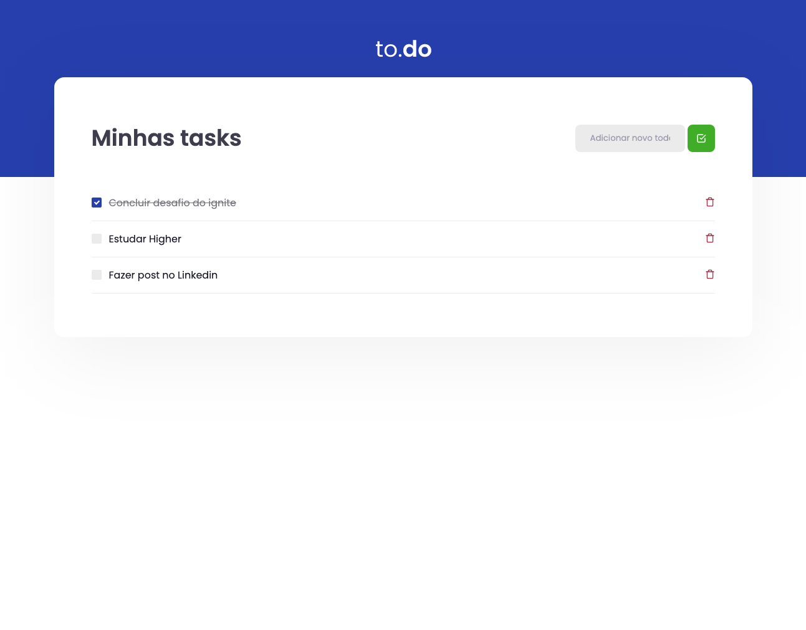
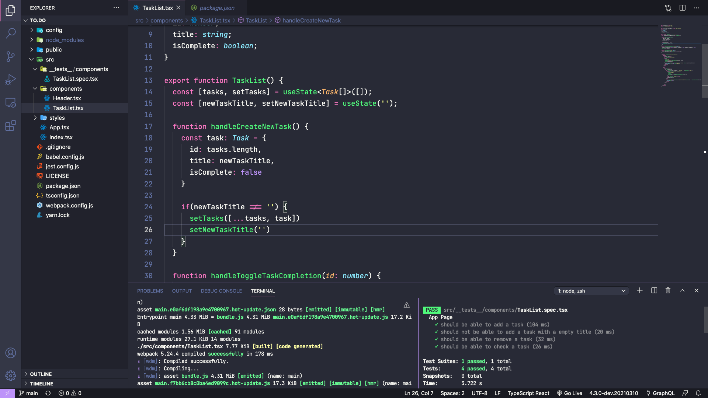

<h1 align="center">
  to.do
</h1>

<h1 align="center">
  
</h1>

## 💬  Sobre
to.do e uma aplicação que foi passada como deasafio no ignite, onde o objetivo era estruturar a lógica do to.do utilizando os conceitos de estado do react.

## 🎯 Objetivo
Fazer com que seja possivel adicionar e remover tarefas, e passar nos testes sugeridos.

## ✅ Resultado dos testes

## 🧐 Aprendizado
Neste desafio aprendi a utilizar o operador spread do javascript para adicionar novos dados a um array, e até mesmo utilizar ele pra remover dados com ele. Também utilizei a função filter para pegar uma tarefa específica do array e com isso fazer o que eu quissese com ele.

## 👨🏻‍🚀 Sobre mim
<a href="https://www.linkedin.com/in/gabriel-mendonca-pereira/">
 
 
Gabriel Mendonça Pereira

</a>
